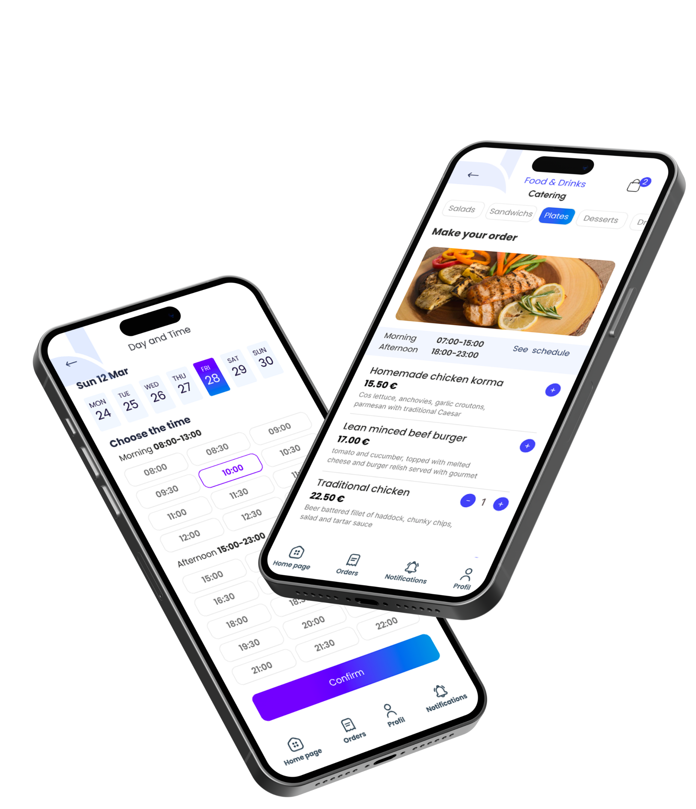
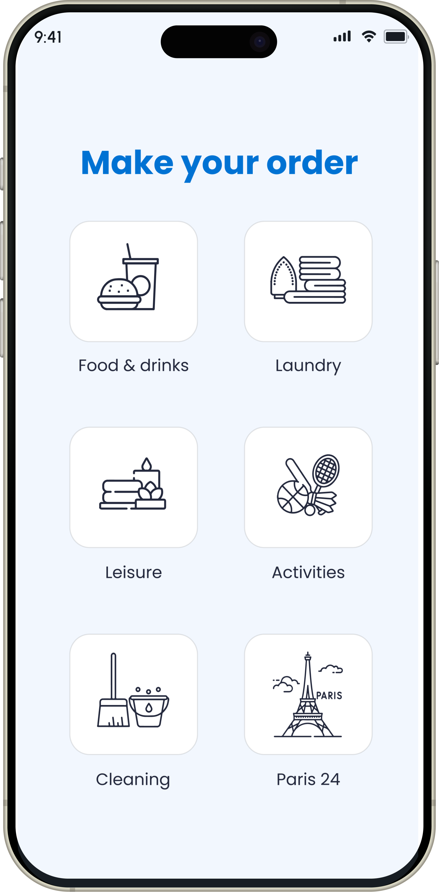
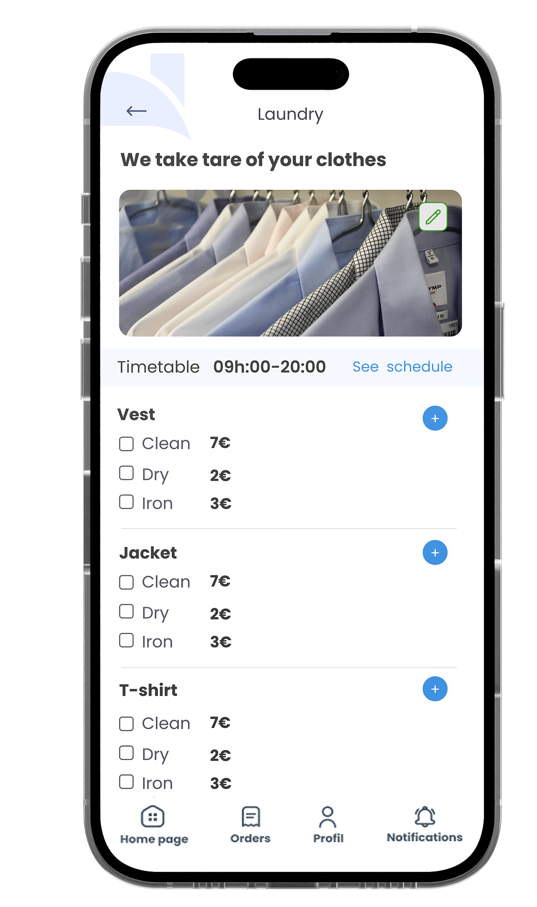
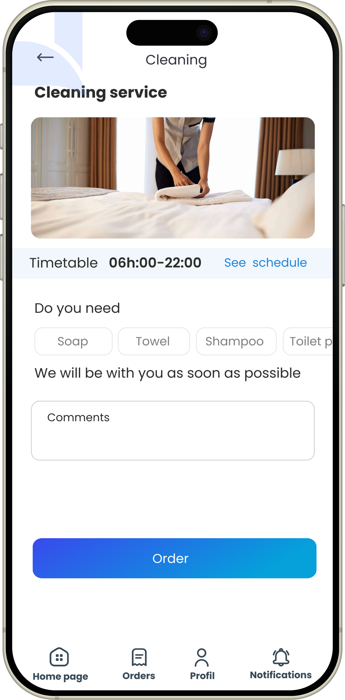
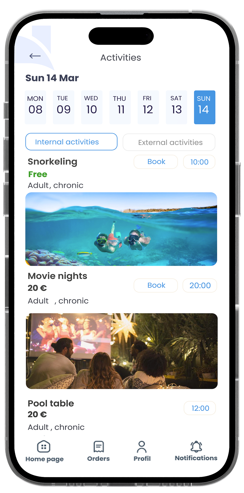
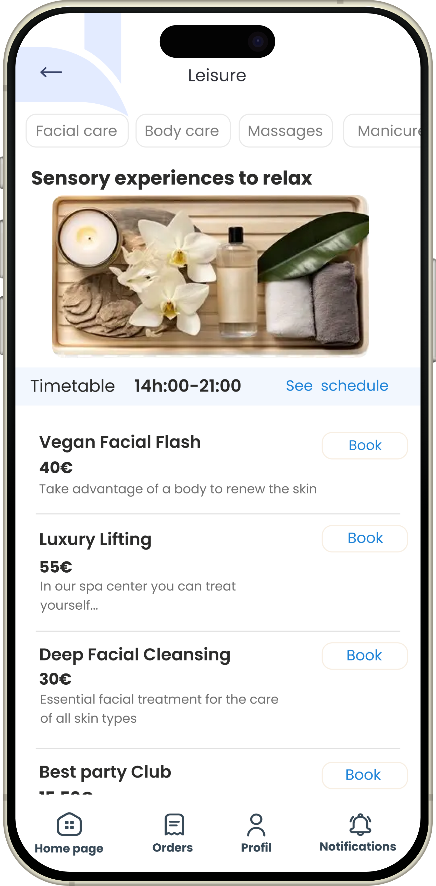
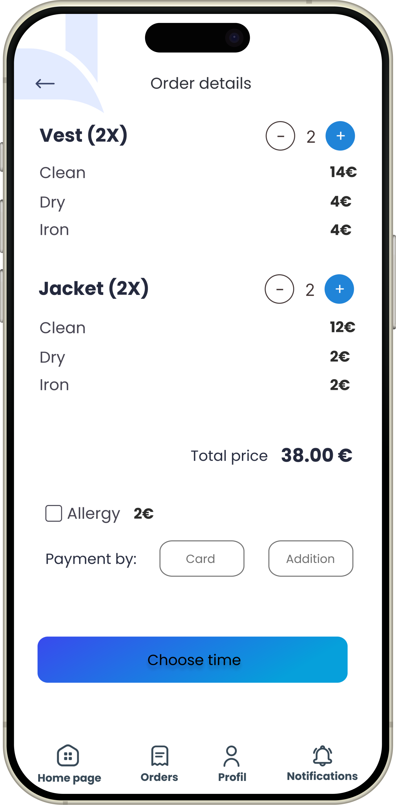
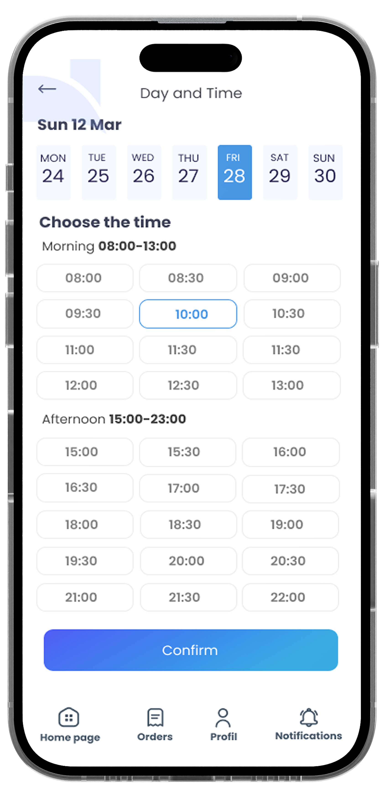
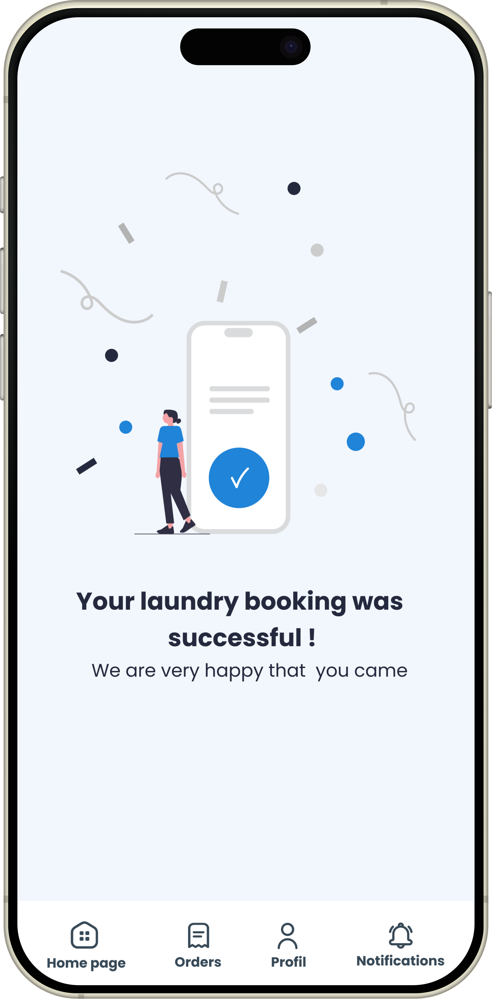

# Diyafa-Guest
The app was developed to allow customers to place orders with specific items of their choice. It included features for scheduling delivery times, addressing errors, and featured a responsive design to ensure compatibility across different devices

## 📱 Screenshots

  
  
  
  
  
  
  
  
  
  
  
  
  

